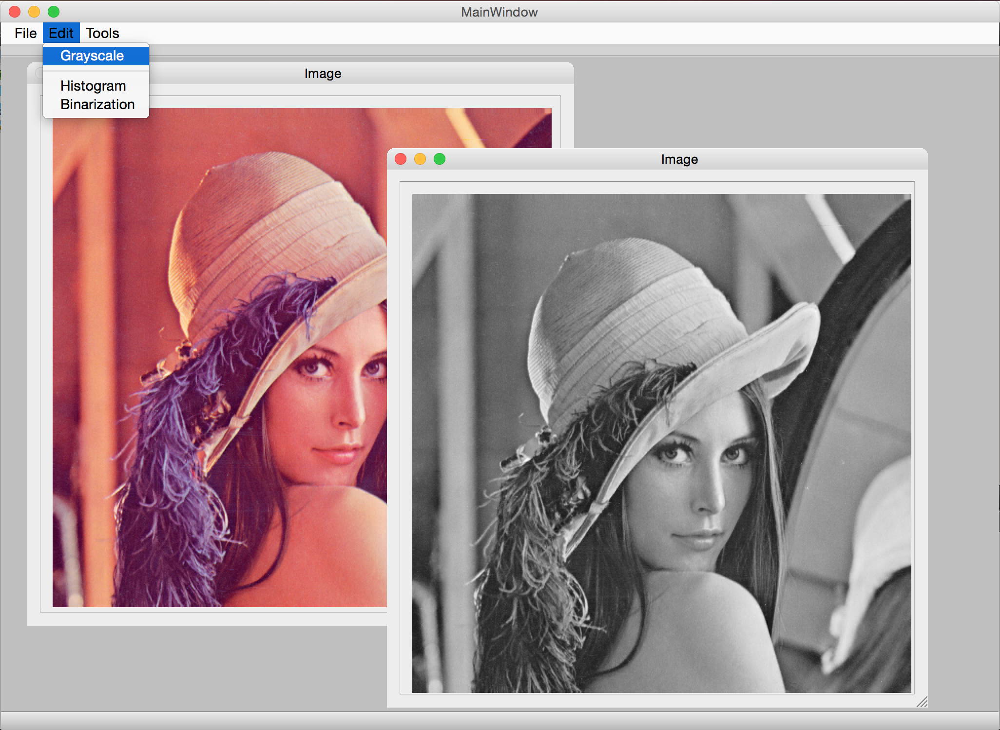
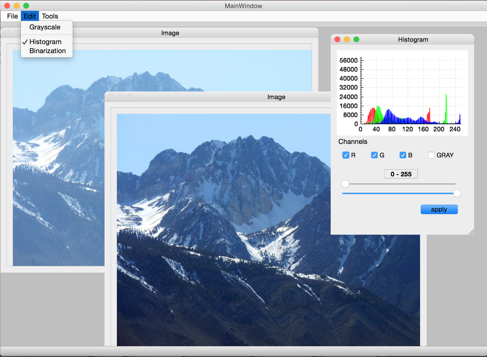
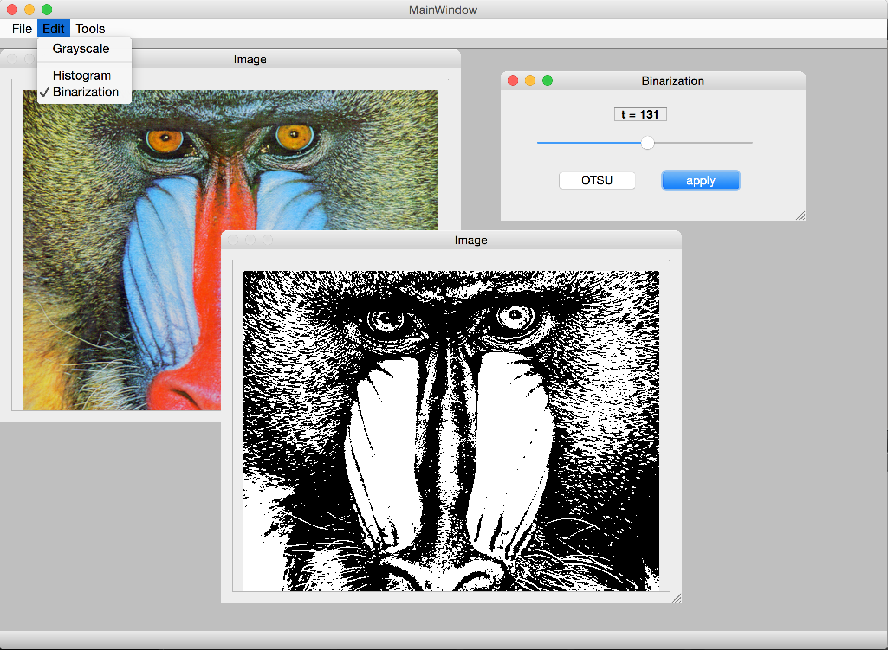
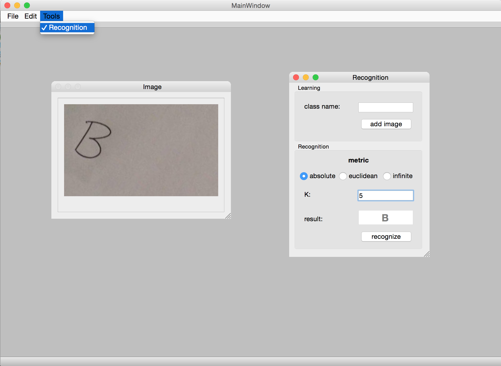

# Image-Analysis
Image Analisys School Project (Qt, C++)

### Features

- **Convert image to grayscale**
- **Histogram equalization**
	- auto
	- manual
- **Image binarization**
	- auto - *Otsu's method*
	- manual
- **Pattern recognition**
	- recognize class
	- add image to class

### Preview

<table width="90%">
	<tr>
		<td>
			
		</td>
		<td>
			
		</td>
	</tr>
	<tr>
		<td>
					</td>
		<td>
			
		</td>
	</tr>
	<tr></tr>
</table>

